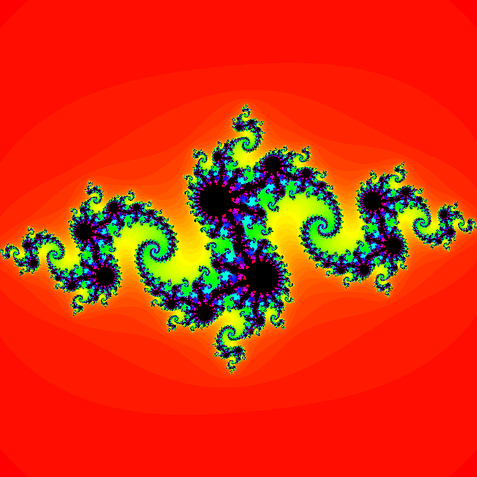

# Julia set

The Julia set is a fractal defined by the following equation:

```math
z_{n+1} = z_n^2 + c
```

where $z$ and $c$ are complex numbers. The Julia set is the set of all complex
numbers $z$ for which the sequence $z_n$ does not diverge to infinity. It is
named after the French mathematician Gaston Julia who studied the set in the
early 20th century.

The Julia set is usually visualized by coloring the complex plane. Each pixel in
the image corresponds to a complex number $z$. The color of the pixel is
determined by the number of iterations it takes for the sequence $z_n$ to
diverge to infinity. If the sequence does not diverge to infinity, the pixel is
colored black.

The Julia set is a fractal because it is self-similar. If you zoom in on any
part of the image, you will see the same pattern repeating itself.

<p align="center">
  
</p>

## How is it calculated?

The `calcJulia` function calculates the number of iterations it takes for the
sequence $z_n$ to diverge to infinity. If the sequence does not diverge to
infinity, the function returns $0$.

```haskell
calcJulia :: Complex Double -> Int
calcJulia z0 = iterateJulia z0 0
  where
    iterateJulia z n
      | n == maxIterations || magnitude z > 2.0 = n
      | otherwise = iterateJulia (z * z + c) (n + 1)
```

The steps of the calculation are as follows:

1. Start with a complex number $z_0$.
2. Calculate the next value of the sequence $z_n$ using the $f$ function.
3. Repeat step 2 until the sequence diverges to infinity or the maximum number
   of iterations is reached.

The `iterateJulia` function uses the f function to calculate the next value of the
sequence $z_n$. The $f$ function takes one parameter: the current value of the
sequence $z_n$. The function returns the next value of the sequence $z_n$.

The $f$ function is defined as follows:

```math
f(z) = z^2 + c
```

The $c$ parameter is a complex number. The $c$ parameter is the same for all
pixels in the image. Modify this parameter to get different images. It is
defined as follows.

```math
c = -0.8 + 0.156i
```

## How to run

1. Install [Haskell](https://www.haskell.org/downloads).
2. Install the dependencies: `cabal install --only-dependencies`.
3. Compile the program: `cabal build`.
4. Run the program: `cabal run`.
5. Open the `julia_set.png` file to see the result.

